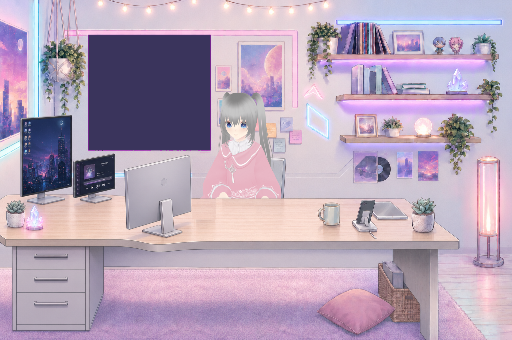

# With Snozzy

一个 macOS 上的 lofi 陪伴应用。Snozzy 在她的房间里陪你工作、学习和发呆；
房间、动作、音乐、番茄钟和对话不是彼此孤立的面板，而是同一段日常。



## 现在有什么

| | |
|---|---|
| **会生活的 Snozzy** | VRoid 角色经 Blender 离线卡通渲染；会呼吸、眨眼、换坐姿、敲键盘、戴耳机，并在你回到前台时抬手托腮凑近看你 |
| **连续近景动作** | 托腮不是两张图硬切：8 张真实骨骼中间帧正放/倒放；上半身、键盘手、托腮手和 13 组面部贴片都使用 2× 源像素 |
| **她主动做的事** | 伸懒腰、端起杯子喝一口、拿起手机敲屏幕。每条都是 8 张中间帧 + **一列循环的停留帧**（脖子晃、小口啜、拇指点），不是举起来冻两秒 |
| **回消息时她也回消息** | `touch ~/Library/Application Support/WithSnozzy/phone.nudge` 就让她拿起手机——判断"我在回微信"这件事交给外面那一层，app 不去读别人的窗口 |
| **深夜会打瞌睡** | 头一点一点往下沉、眼皮跟着合，沉到底猛地惊醒抬起来、眼睛短暂睁大，过几秒再来一轮 |
| **活动闭环** | typing / researching / planning / resting / takingBreak 同时驱动视线、打字节奏、侧屏、杯子热气和手机亮屏 |
| **会记得你** | 结构化长期记忆，可分类、固定、删除；“记住……”与“忘掉……”本地即时生效，重启和 Claude 热会话都能取回相关记忆 |
| **可以聊天** | 默认调用本机已登录的 Claude CLI 常驻流式会话，也可选 Codex；知道当前音乐、番茄钟和待办 |
| **可以直接说** | Apple 本地语音识别，说完自动发送；回复可由系统 TTS 或外部本机 TTS 服务念出 |
| **Snozzy 的电台** | 实时 DSP 合成 lofi：爵士和弦、贝斯、鼓、旋律、磁带抖动与黑胶噪声，不是循环播放 mp3 |
| **环境与效率工具** | 六路环境音、本地音乐与音乐 App、番茄钟、专注统计、待办、昼夜天气、菜单栏与媒体键 |
| **三种窗口形态** | 完整窗口 / 迷你播放器 / 透明桌宠；后两者是同一套渲染素材裁出来的胸像，不再是另一个画风的简笔小人。被遮挡或最小化时暂停动画时间线 |

## 为什么不是运行时 3D

当前相机和房间构图是固定的。运行时 3D 不会凭空增加可见细节，却会要求重建已经完成的
插画房间、材质、遮挡、222 根骨骼、58 个形态键和头发物理。项目因此采用混合 2.5D：

```text
Snozzy.vrm ── Blender 离线渲染 ──> 分层 PNG / 动作帧 / 面部贴片
交付房间图 ── 遮罩与切层 ───────> room + desk
SwiftUI ───────────────────────> 实时表情、天气、活动反馈、UI 与交互
```

这保留了 Blender/VRoid 的三维姿态质量，也保留了手绘房间的统一画风和像素级遮挡。
需要新的动作时扩展离线动画素材；只有未来真的加入自由镜头，才值得迁移到运行时 3D。

## 构建与运行

需要 macOS 14+、Xcode 命令行工具和 Swift 6。Swift 代码没有第三方包依赖。

```bash
Scripts/run.sh            # 构建 release 并启动
Scripts/run.sh debug      # 开发构建
Scripts/build_app.sh      # 打包到 dist/WithSnozzy.app
```

默认渲染角色所需的发布素材已经在 `Assets/`。重新生成角色素材需要 Blender 5.2 LTS；
VRoid Studio 只在修改 `Snozzy.vrm` 外观时需要。

## 设计原则

1. **视觉与行为要联动。** 番茄钟阶段不仅改文字，也改变她在看哪里、手在做什么和房间反馈。
2. **位图动作必须有真实中间姿势。** 换腿和托腮都播放 Blender 骨骼插值帧，不用交叉淡入伪装动作。
3. **主观问题做成可测。** 用剪影变化、像素漂移、贴片碰撞、取景边界和真实层序快照验收。
4. **零第三方 Swift 依赖。** 运行时只用系统框架；Blender/VRoid/TTS 是可替换的离线或外部工具。
5. **维护性优先于炫技。** 固定镜头继续用成熟的 2.5D 管线；素材不完整时整套回退，不在半程闪帧。

## 数据与隐私

数据位于 `~/Library/Application Support/WithSnozzy/`，主要文件都是可读的 JSON：

| 文件 | 内容 |
|---|---|
| `settings.json` | 音量、时段、天气、窗口、角色与对话设置 |
| `tasks.json` | 待办 |
| `focus-history.json` | 每日专注时长与累计段数 |
| `focus-settings.json` | 番茄钟配置 |
| `library.json` | 音乐文件夹路径与播放选项 |
| `chat.json` | 最近聊天记录 |
| `memories.json` | 分类、固定状态和时间戳等长期记忆 |
| `state.json` / `inbox.json` | 本机 MCP 状态快照与跨进程收件箱 |

语音识别强制使用 Apple 的本地识别。长期记忆保存在本机；当回答涉及某条记忆时，
相关、固定及“关于你”条目会作为上下文发送给用户选择的 Claude/Codex，界面中
也有同样提示。无查询词的 MCP `get_state` 不附带长期记忆。

设置里的“清空全部数据”会先确认，再删除待办、专注、聊天、记忆、设置、状态
快照与隐私日志并退出；不会在退出回调里把内存数据重新写回来。

## 角色渲染

设置里可选择：

| | 说明 |
|---|---|
| **渲染 Snozzy** | 默认。VRoid → Blender → 分层 2.5D 素材，包含动作帧、3D 键盘、耳机与面部贴片 |
| **Live2D 模型** | 可选。需要额外放置 Cubism Core 与模型，详见 `Vendor/README.md` |

渲染素材缺失时仍保留程序化角色/房间回退，不会拖垮音乐、番茄钟或其它功能。

## 开发与自检

```bash
BIN=dist/WithSnozzy.app/Contents/MacOS/WithSnozzy

$BIN --render /tmp/out.wav                 # 离线渲音乐并分析
$BIN --snapshot /tmp/poses.png             # 表情与时段
$BIN --legstrip /tmp/legs.png              # 换腿真实中间帧
$BIN --handstrip /tmp/hands.png            # 键盘手与桌面层序
$BIN --facestrip /tmp/faces.png            # 表情分布
$BIN --closeup /tmp/closeup.png            # 近景完整正放/倒放与取景
$BIN --activitycheck                       # 活动覆盖与过渡连续性
$BIN --activitystrip /tmp/activity.png     # 动态层在真实房间上的落点
$BIN --memorycheck                         # 隔离的记忆命令/检索/边界测试
$BIN --facefit /tmp/facefit.png            # 非 3:2 窗口的贴片对位
```

完整美术管线、验证阈值和踩坑记录见 [`HANDOFF.md`](HANDOFF.md)。

## 目录结构

```text
Sources/WithSnozzy/  SwiftUI 应用、音频、角色、场景、功能与 UI
Blender/             VRM 姿态、道具、渲染和几何判据
Scripts/             构建、切层、切帧与像素判据
Assets/              运行时发布素材
Art/                 场景源图、遮罩与美术说明
Plugin/              WithSnozzy 本机 MCP 插件
Resources/           Info.plist 等应用资源
```
